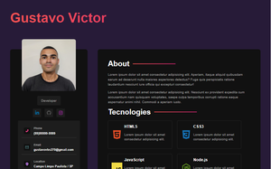
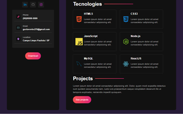
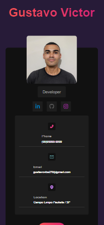
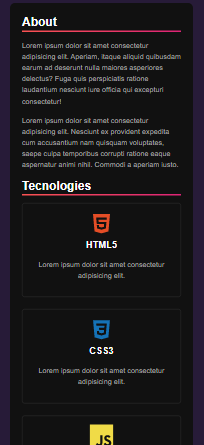
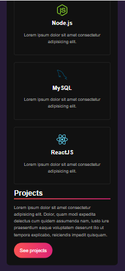

<h1 align='center'>Portfolio Layout </h1>

<p align="center">
  <a href="#-sobre">Sobre</a>&nbsp;&nbsp;&nbsp;|&nbsp;&nbsp;&nbsp;
  <a href="#-prints">Prints</a>&nbsp;&nbsp;&nbsp;|&nbsp;&nbsp;&nbsp;
  <a href="#-tecnologias">Tecnologias</a>&nbsp;&nbsp;&nbsp;|&nbsp;&nbsp;&nbsp;
  <a href="#-instalação">Instalação</a>&nbsp;&nbsp;&nbsp;|&nbsp;&nbsp;&nbsp;
  <a href="#-licença">Licença</a>&nbsp;&nbsp;&nbsp;|&nbsp;&nbsp;&nbsp;
</p>


## ❓ Sobre

Este projeto é uma aplicação React simples com um layout de portfolio de desenvolvedor web. 

O projeto foi desenvolvido durante um [tutorial do youtube](https://www.youtube.com/watch?v=5h4vMtBlQQU&list=WL&index=19) do canal [Hora de Codar](https://www.youtube.com/@MatheusBattisti), porém eu fiz algumas modicações no projeto para deixar ele mais único. O intuito do projeto é praticar a integração do React com Sass.  

## 📷 Prints

 

  

## 🛠 Tecnologias

- Bibliotecas / Frameworks: 
    - [ReactJS](https://pt-br.reactjs.org/)
    
- Dependências
    - [Sass](https://sass-lang.com/)
    - [React Icons](https://react-icons.github.io/react-icons/)
    - [Vite](https://vitejs.dev/)
    
- Ferramentas / Recursos: 
    - Editor: [Visual Studio Code](https://code.visualstudio.com/)


Veja como ficou o arquivo [package.json](./package.json). 


## 💻 Instalação

Para começar a usar o projeto, você precisa ter instalado em sua máquina o [Node.js](https://nodejs.org/en/); além disso, é bom você possuir alguns conhecimentos básicos sobre HTML, CSS e JavaScript para conseguir acopanhar e entender o projeto. 

Para instalar o projeto e usar ele no seu computador, basta seguir os passos: 

1. Clonar o projeto 
```bash  
    git clone https://github.com/Gustavo-Victor/portfolio-layout.git
``` 

2. Instalar dependências 
```bash  
    cd portfolio-layout/
    npm install
``` 

3. Executar o projeto em modo de desenvolvimento 
```bash  
    npm run dev
``` 

## 📝 Licença 

O projeto está sob a [Licensa MIT](./LICENSE) 

Qualquer pessoa pode usar, clonar e contribuir com este projeto. 

